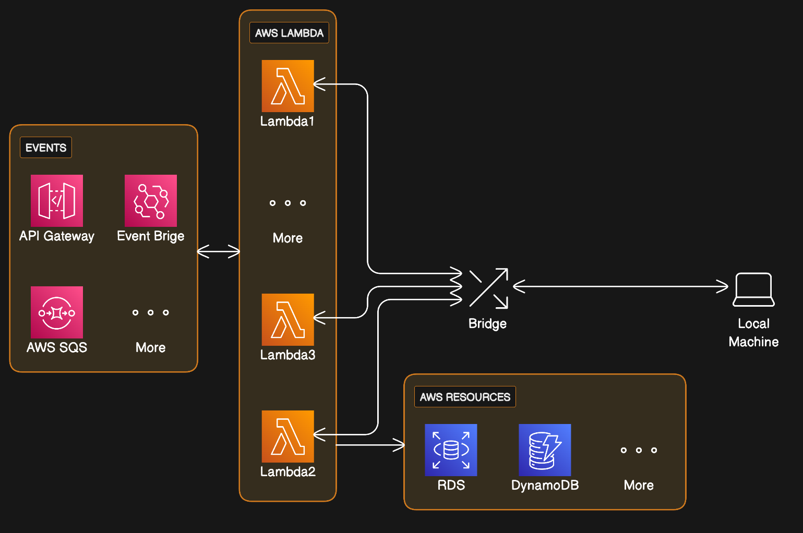

# Serverless Live Lambda



This Serverless plugin forwards the payload from Lambda to the local machine, supporting faster
development cycles. Unlike `serverless-offline`, this plugin does not emulate the Lambda environment;
instead, it directly forwards the payload to the local machine.

**Features:**

- Supports Go λ runtimes. There are plans to support Node.js and Python soon.
- Hot reloads your handler files.

This plugin is updated by its users; I handle maintenance and ensure that pull requests (PRs)
are relevant to the community. In other words, if you find a bug or want a new feature,
please contribute and become one of the contributors! See the contributing section.

## How it differs from SST

SST is great! This plugin was crafted based on the Live Lambda feature of [SST](https://docs.sst.dev/live-lambda-development).
However, there are significant distinctions. Unlike SST, this plugin doesn't create a new personal stack;
instead, it directly utilizes the existing development stack. To achieve this streamlined approach,
it use a bridge library to seamlessly switch and handle the payload between the remote and local machine.

## Installation

First, add `Serverless Live Lambda` to your project:

```bash
npm install serverless-live-lambda --save-dev
```

Then, inside your project's `serverless.yml` file, add the following entry to the plugins section:
`serverless-live-lambda`. If there is no plugin section, you will need to add it to the file.

It should look something like this:

```yaml
plugins:
  - serverless-live-lambda
```

This plugin uses AWS IoT over WebSocket to communicate between your local machine and the remote Lambda function.
For large payloads, it places them into the S3 Serverless deployment bucket. To ensure the plugin operates without errors,
you need to assign the required permissions to the functions.

The permissions look like this:

```yaml
provider:
  iam:
    role:
      statements:
        - Effect: Allow
          Action:
            - 's3:GetObject'
            - 's3:DeleteObject'
          Resource:
            - !Sub '${ServerlessDeploymentBucket.Arn}/*'
        - Effect: Allow
          Action:
            - 'iot:Connect'
            - 'iot:DescribeEndpoint'
          Resource: '*'
        - Effect: Allow
          Action:
            - 'iot:Publish'
            - 'iot:Subscribe'
            - 'iot:Receive'
          Resource:
            - 'arn:aws:iot:*:*:topic/serverless/*'
            - 'arn:aws:iot:*:*:topicfilter/serverless/*'
```

Lastly, initiate the server to facilitate the transfer of the payload from the remote Lambda to
the local environment:

```bash
serverless start
```

## Go Development

Currently, the plugin does not support deploying Go lambdas. For Go lambda deployments,
I recommend you to use the [serverless-go-plugin](https://www.npmjs.com/package/serverless-go-plugin)
to build and deploy your lambda.

It should look something like this:

```yaml
custom:
  go:
    binDir: bin
    cmd: GOARCH=amd64 GOOS=linux go build -ldflags="-s -w"
    supportedRuntimes: ['provided.al2']
    buildProvidedRuntimeAsBootstrap: true

plugins:
  - serverless-go-plugin
```

This plugin also supports debugging Go on a local machine. You can start the server in debug mode with the
following command:

```bash
serverless start -m debug -f {function}
```

After successfully starting the server, you must configure the debugger to load the generated environment file
located at `${workspaceFolder}/.serverless/.env`.

An example for VSCode:

```json
{
  "version": "0.2.0",
  "configurations": [
    {
      "name": "Debug Go",
      "type": "go",
      "request": "launch",
      "mode": "auto",
      "envFile": "${workspaceFolder}/.serverless/.env",
      "program": "${workspaceFolder}/cmd/api"
    }
  ]
}
```

Here are some important notes when you run debug:

- While in debug mode, some features may be disabled, such as hot reload.
- Lambda function may timeout when running in debug mode. To resolve the problem,
  you can increase the timeout of the function.
- Some services, like AWS API Gateway or AppSync, have timeout limits (e.g., 30s).
  The service may respond with the error `Service Unavailable` when the function exceeds its timeout.

## Bridge Library

Currently, this plugin exclusively supports the Go runtime, with plans underway to extend support
to additional runtimes. To forward the payload from Lambda, you need to install the bridge library
to your codes.

You can find the libraries here:

| Language | Library                                              |
| -------- | ---------------------------------------------------- |
| Go       | github.com/aboutkh/serverless-live-lambda/support/go |

For Go example:

```go
package main

import (
	bridge "github.com/aboutkh/serverless-live-lambda/support/go"

	"github.com/aws/aws-lambda-go/lambda"
)

func main() {
	srv := newServer()
	handler := srv.Setup()
	lambda.Start(bridge.Wrap(handler))
}
```

## Examples

| Name                 | Language | Link                                                                                                         |
| -------------------- | -------- | ------------------------------------------------------------------------------------------------------------ |
| graphql-apigw-lambda | Go       | [Example Link](https://github.com/aboutkh/serverless-live-lambda/tree/main/examples/go/graphql-apigw-lambda) |
